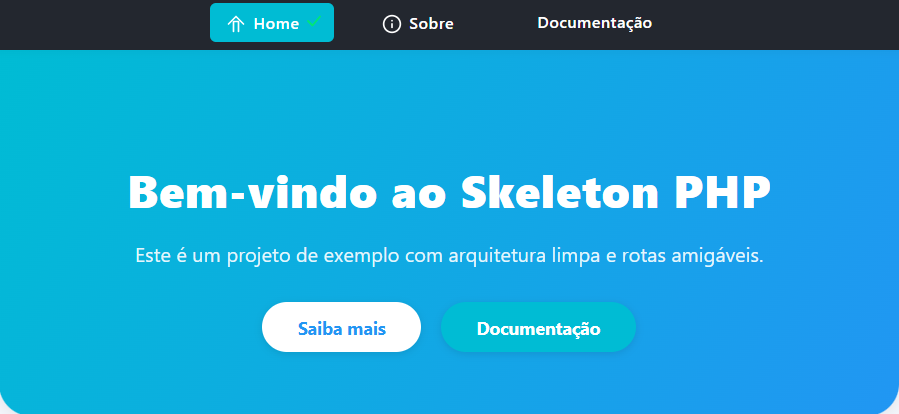
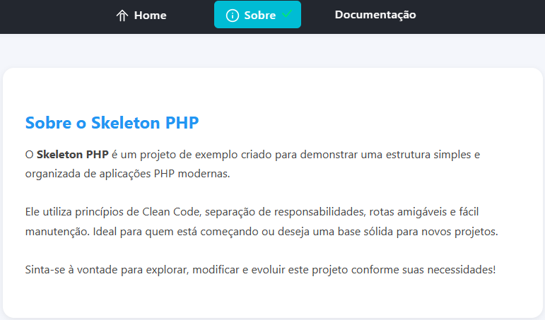
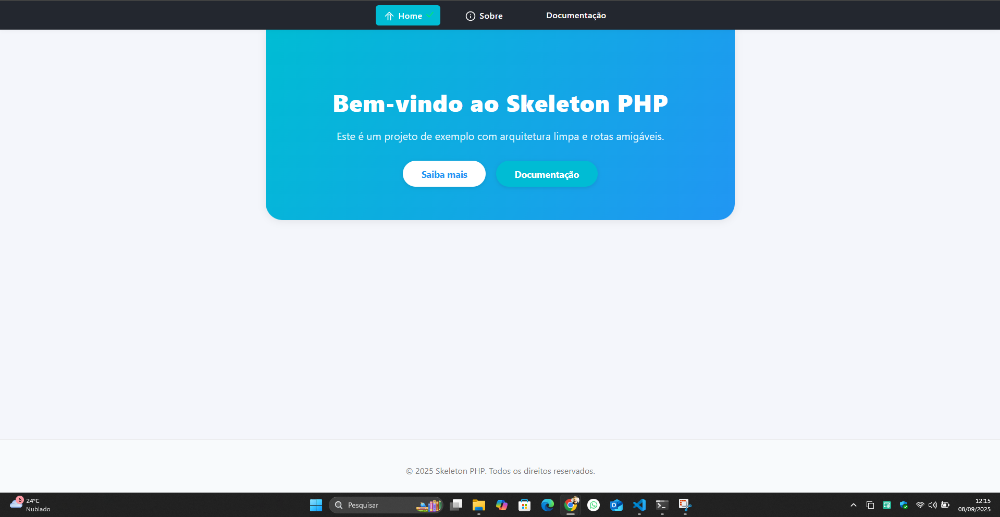
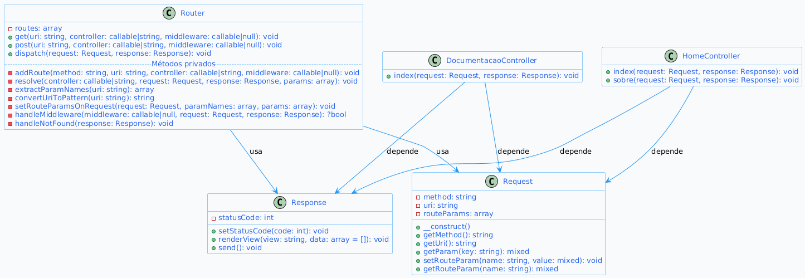

<div align="center" style="margin-bottom:2.5rem;">
    
    
    
    <br>
    <span style="color:#888;font-size:0.98em;">Mockups das principais telas do Skeleton PHP</span>
</div>

# Estrutura de Projeto PHP

Este é um esqueleto base para projetos PHP, projetado para ser modular, organizado e reutilizável. Ele utiliza um roteador customizado e suporte para controladores, modelos e visualizações.

---


## 📊 Diagrama de Classes

<div align="center">
    
    <br>
    <span style="color:#888;font-size:0.98em;">Visualização do diagrama de classes do projeto</span>
</div>

## 📁 Estrutura do Projeto


# Skeleton PHP

> Estrutura moderna, clean e pronta para projetos PHP profissionais.

---

## 📁 Estrutura do Projeto

```
Skeleton-php/
├── app/
│   ├── Controllers/
│   ├── Core/
│   ├── Views/
│   │   └── partials/
│   └── Router.php
├── config.php
├── config/
│   └── env.php
├── public/
│   └── assets/
│       └── css/
├── routes/
│   └── web.php
├── vendor/
├── .env
├── index.php
└── README.md
```

### Descrição das Pastas e Arquivos

- **app/Controllers/**: Controladores da aplicação.
- **app/Core/**: Classes centrais (Request, Response, etc).
- **app/Views/**: Views (HTML) e partials reutilizáveis.
- **app/Router.php**: Sistema de rotas.
- **config.php**: Configurações centralizadas (usa .env).
- **config/env.php**: Loader do .env.
- **public/assets/css/**: Arquivos CSS.
- **routes/web.php**: Definição das rotas.
- **index.php**: Ponto de entrada da aplicação.

---

## ⚙️ Variáveis de Ambiente

As variáveis ficam no arquivo `.env` e são carregadas automaticamente. Exemplo:

```
APP_NAME=Skeleton PHP
APP_ENV=local
APP_DEBUG=true
APP_URL=http://localhost:8000
DB_CONNECTION=mysql
DB_HOST=127.0.0.1
DB_PORT=3306
DB_DATABASE=skeleton
DB_USERNAME=root
DB_PASSWORD=
SESSION_NAME=skeleton_session
```

Use-as via `getenv('NOME')` ou pelo array `$config`.

---

## 🚦 Rotas

Definidas em `routes/web.php`:

```php
$router->get('', 'HomeController@index');
$router->get('sobre', 'HomeController@sobre');
$router->get('produto/{id}', 'ProdutoController@show');
$router->get('documentacao', 'DocumentacaoController@index');
```

---

## 🛡️ Tratamento de Erros

- **404**: Tratado no `Router.php` (view `errors/404.php`).
- **500**: Tratado globalmente no `index.php` (view `errors/500.php`).

---

## 🧪 Testes

- Testes manuais de navegação, rotas, parâmetros e tratamento de erros.
- Testes de renderização de views e integração de controllers.
- Recomenda-se PHPUnit para testes automatizados.

---

## 🚀 Como Rodar o Projeto

### Pré-requisitos

- PHP 8.1+ (ou superior)
- Composer

### Passo a Passo

1. Clone o repositório:
    ```bash
    git clone https://github.com/seu-usuario/skeleton-php.git
    cd skeleton-php
    ```
2. Instale as dependências:
    ```bash
    composer install
    ```
3. Configure o arquivo `.env` conforme seu ambiente.
4. Inicie o servidor embutido do PHP:
    ```bash
    php -S localhost:8000 -t public
    ```
5. Acesse [http://localhost:8000](http://localhost:8000) no navegador.

---

## � Dicas e Boas Práticas

- Separe lógica de negócio em controllers e views.
- Use variáveis do `.env` para facilitar deploys e configurações.
- Aproveite os partials para menus, headers e footers reutilizáveis.
- Siga o padrão MVC para facilitar manutenção e testes.

---

## 🤝 Contribuição

Contribuições são bem-vindas!

1. Faça um fork do projeto.
2. Crie uma branch: `git checkout -b minha-funcionalidade`.
3. Commit: `git commit -m "feat: minha funcionalidade"`.
4. Push: `git push origin minha-funcionalidade`.
5. Abra um Pull Request.

---

## 📝 Licença

MIT. Consulte o arquivo LICENSE para mais informações.